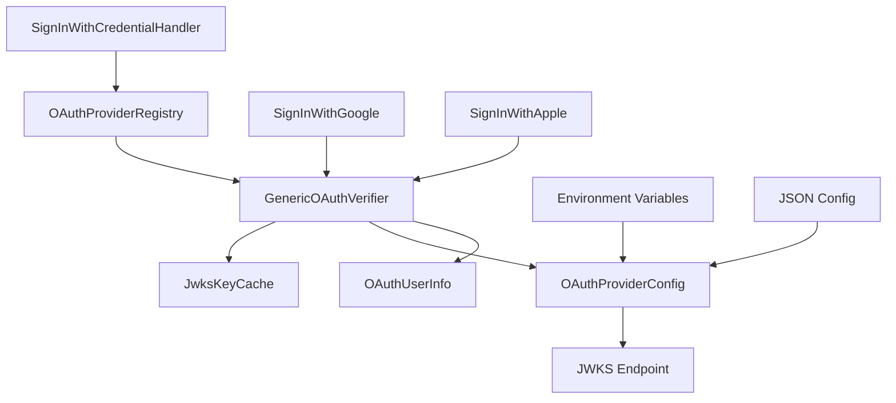

# Design Document

## Overview

This design transforms the current provider-specific OAuth implementations into a unified, configurable system that supports any OAuth 2.0/OpenID Connect provider. The solution maintains backward compatibility while introducing a generic OAuth verification system that can automatically discover provider configurations and verify JWT tokens from any compliant OAuth provider.

The design follows the principle of convention over configuration, where providers that follow OpenID Connect standards can be configured with minimal setup, while still allowing for custom configurations when needed.

## Architecture

### Core Components

1. **GenericOAuthVerifier**: Main class that handles JWT verification for any OAuth provider
2. **OAuthProviderConfig**: Configuration class that holds provider-specific settings
3. **OAuthProviderRegistry**: Registry that manages multiple OAuth provider configurations
4. **JwksKeyCache**: Caching mechanism for provider public keys to improve performance
5. **OAuthUserInfo**: Standardized user information extracted from verified tokens

### Component Relationships



## Components and Interfaces

### GenericOAuthVerifier

```dart
class GenericOAuthVerifier {
  Future<OAuthUserInfo> verifyToken(String token, String providerId);
  Future<void> refreshProviderKeys(String providerId);
}
```

**Responsibilities:**

- Parse and validate JWT tokens
- Fetch and cache provider public keys from JWKS endpoints
- Verify token signatures using RSA/ECDSA algorithms
- Validate standard JWT claims (iss, aud, exp, iat)
- Extract user information from verified tokens

### OAuthProviderConfig

```dart
class OAuthProviderConfig {
  final String id;
  final String issuer;
  final String clientId;
  final String? jwksUri;
  final Duration keysCacheDuration;
  final List<String> requiredClaims;
  final Map<String, String> claimMappings;
}
```

**Responsibilities:**

- Store provider-specific configuration
- Support auto-discovery of JWKS endpoints via OpenID Connect well-known endpoints
- Define claim mappings for non-standard provider implementations
- Configure caching and validation parameters

### OAuthProviderRegistry

```dart
class OAuthProviderRegistry {
  void registerProvider(OAuthProviderConfig config);
  OAuthProviderConfig? getProvider(String providerId);
  List<String> getRegisteredProviders();
  Future<void> loadFromEnvironment();
  Future<void> loadFromJson(String configPath);
}
```

**Responsibilities:**

- Manage multiple OAuth provider configurations
- Load configurations from environment variables and JSON files
- Provide provider lookup functionality
- Support dynamic configuration updates

### JwksKeyCache

```dart
class JwksKeyCache {
  Future<List<JsonWebKey>> getKeys(String jwksUri);
  void invalidateCache(String jwksUri);
  void clearCache();
}
```

**Responsibilities:**

- Cache provider public keys to reduce network requests
- Handle cache expiration and refresh
- Support manual cache invalidation
- Implement fallback mechanisms for network failures

### OAuthUserInfo

```dart
class OAuthUserInfo {
  final String sub;
  final String? email;
  final bool? emailVerified;
  final String? name;
  final String? picture;
  final Map<String, dynamic> additionalClaims;
}
```

**Responsibilities:**

- Provide standardized user information structure
- Support common OAuth/OpenID Connect claims
- Allow access to provider-specific additional claims

## Data Models

### Configuration Structure

**Environment Variables:**

```
OAUTH_PROVIDERS_CONFIG_PATH=/path/to/oauth-config.json
OAUTH_GOOGLE_CLIENT_ID=your-google-client-id
OAUTH_GOOGLE_ISSUER=https://accounts.google.com
OAUTH_APPLE_CLIENT_ID=your-apple-bundle-id
OAUTH_APPLE_ISSUER=https://appleid.apple.com
```

**JSON Configuration:**

```json
{
  "providers": {
    "google": {
      "issuer": "https://accounts.google.com",
      "clientId": "${GOOGLE_CLIENT_ID}",
      "jwksUri": "https://www.googleapis.com/oauth2/v3/certs",
      "keysCacheDuration": "1h",
      "requiredClaims": ["email", "email_verified"]
    },
    "apple": {
      "issuer": "https://appleid.apple.com",
      "clientId": "${APPLE_BUNDLE_ID}",
      "jwksUri": "https://appleid.apple.com/auth/keys",
      "keysCacheDuration": "24h"
    },
    "custom-provider": {
      "issuer": "https://auth.example.com",
      "clientId": "your-client-id",
      "autoDiscovery": true,
      "claimMappings": {
        "email": "user_email",
        "name": "full_name"
      }
    }
  }
}
```

### JWT Token Structure

The system will handle standard JWT tokens with the following structure:

**Header:**

```json
{
  "alg": "RS256",
  "kid": "key-id",
  "typ": "JWT"
}
```

**Payload (Standard Claims):**

```json
{
  "iss": "https://provider.com",
  "aud": "client-id",
  "sub": "user-unique-id",
  "exp": 1234567890,
  "iat": 1234567890,
  "email": "user@example.com",
  "email_verified": true,
  "name": "User Name",
  "picture": "https://example.com/avatar.jpg"
}
```

## Error Handling

### Error Types

```dart
enum OAuthVerificationError {
  invalidTokenFormat,
  invalidSignature,
  tokenExpired,
  invalidAudience,
  invalidIssuer,
  missingRequiredClaims,
  providerNotConfigured,
  jwksUnavailable,
  networkError,
  unknownError
}
```

### Error Response Structure

```dart
class OAuthVerificationException implements Exception {
  final OAuthVerificationError type;
  final String message;
  final String? providerId;
  final Map<String, dynamic>? details;
}
```

### Error Handling Strategy

1. **Network Failures**: Implement retry logic with exponential backoff for JWKS endpoint requests
2. **Cache Fallback**: Use cached keys when JWKS endpoint is unavailable
3. **Graceful Degradation**: Continue with available providers when some configurations fail
4. **Detailed Logging**: Log all verification attempts with sufficient detail for debugging
5. **User-Friendly Messages**: Provide clear error messages that don't expose internal details

## Testing Strategy

### Unit Tests

1. **Token Parsing Tests**

   - Valid JWT token parsing
   - Invalid token format handling
   - Malformed header/payload handling

2. **Signature Verification Tests**

   - Valid signature verification with RSA and ECDSA keys
   - Invalid signature detection
   - Key rotation handling

3. **Claims Validation Tests**

   - Standard claims validation (iss, aud, exp, iat)
   - Custom claims validation
   - Missing required claims handling

4. **Configuration Tests**
   - Environment variable loading
   - JSON configuration parsing
   - Auto-discovery functionality
   - Provider registration and lookup

### Integration Tests

1. **Provider Integration Tests**

   - Google OAuth token verification
   - Apple OAuth token verification
   - Custom provider token verification
   - Multi-provider scenarios

2. **Cache Tests**

   - Key caching functionality
   - Cache expiration handling
   - Cache invalidation
   - Network failure fallback

3. **Handler Integration Tests**
   - SignInWithCredentialHandler with generic OAuth
   - Backward compatibility with existing implementations
   - Error response handling

### Mock Strategy

1. **JWKS Endpoint Mocking**: Mock HTTP responses for provider JWKS endpoints
2. **Token Generation**: Create valid test tokens with known keys for verification
3. **Network Failure Simulation**: Simulate network failures and timeouts
4. **Configuration Mocking**: Test various configuration scenarios

### Performance Tests

1. **Key Caching Performance**: Measure cache hit rates and response times
2. **Concurrent Verification**: Test multiple simultaneous token verifications
3. **Memory Usage**: Monitor memory usage with large numbers of cached keys
4. **Network Latency**: Test behavior under various network conditions

## Migration Strategy

### Backward Compatibility

The existing `SignInWithGoogle` and `SignInWithApple` classes will be maintained as wrapper classes that internally use the new `GenericOAuthVerifier`. This ensures zero breaking changes for existing implementations.

### Migration Path

1. **Phase 1**: Implement generic OAuth system alongside existing implementations
2. **Phase 2**: Update existing classes to use generic system internally
3. **Phase 3**: Provide migration documentation and examples
4. **Phase 4**: Deprecate provider-specific classes (optional, future consideration)

### Configuration Migration

Existing environment variables (`GOOGLE_CLIENT_ID`, `APPLE_BUNDLE_ID`, etc.) will continue to work through automatic configuration mapping in the `OAuthProviderRegistry`.
